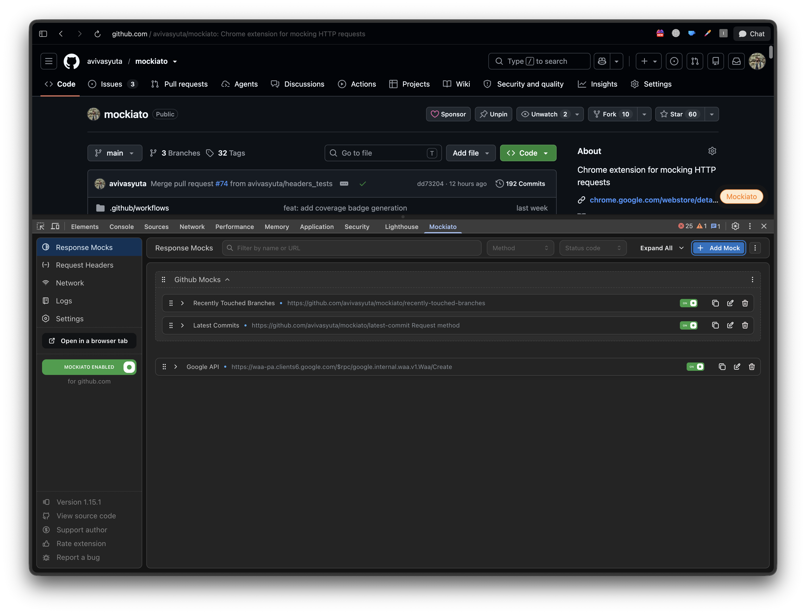
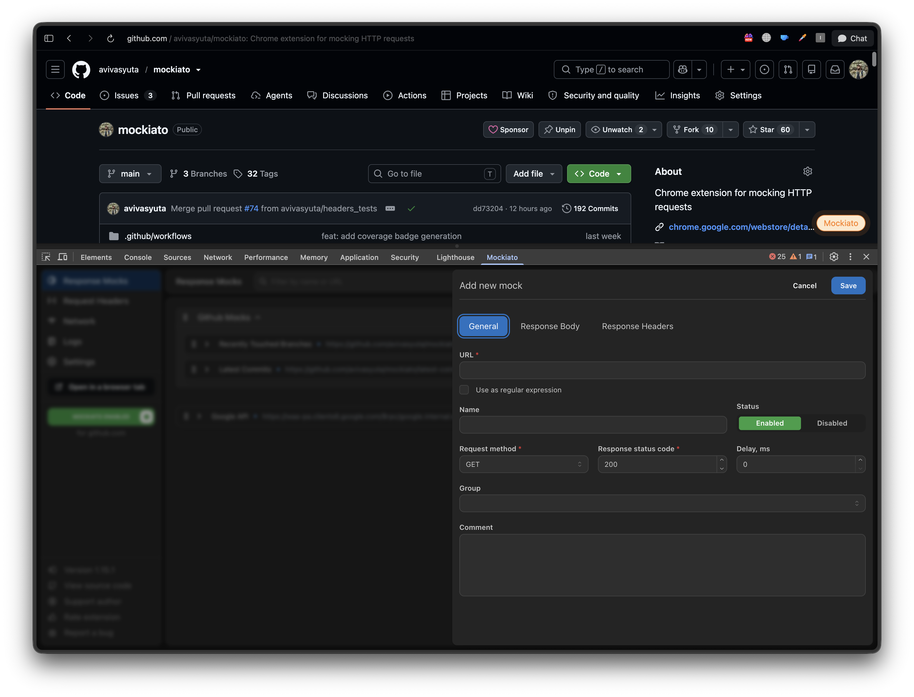
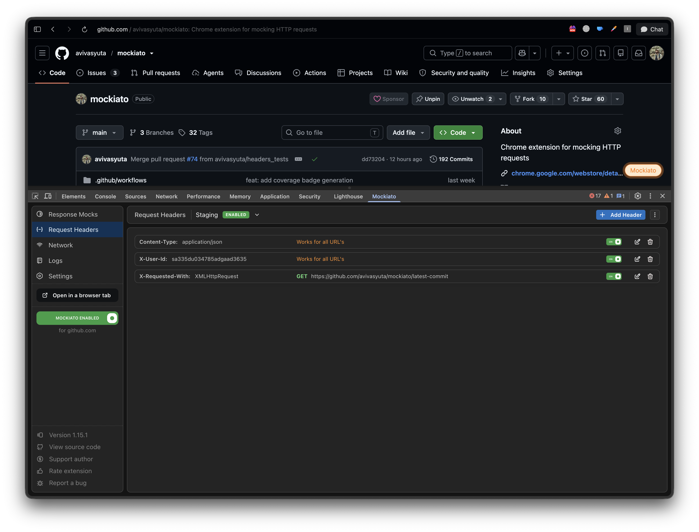
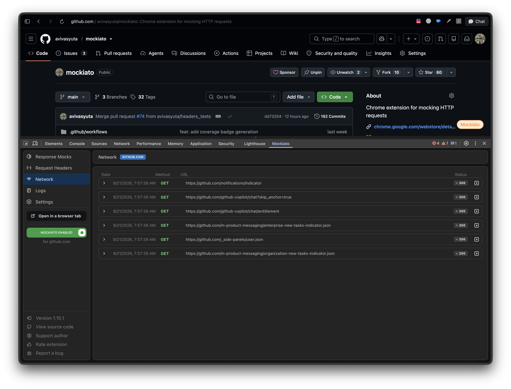

  

<h1 align="center">Mockiato</h1>

<strong>Mock API requests. Simulate real-world conditions. No proxy, no code changes.</strong>

  
  
  
  
  

  <a href="#features">Features</a> ·
  <a href="#screenshots">Screenshots</a> ·
  <a href="#installation">Installation</a> ·
  <a href="#getting-started">Getting Started</a> ·
  <a href="#contributing">Contributing</a>

Mockiato is a free Chrome extension for **mocking API requests and intercepting HTTP responses directly inside DevTools** - no local proxy, no backend changes, and no code to touch. It's built for developers and QA engineers who need to simulate network conditions, test edge cases, and prototype against APIs that don't exist yet.

With Mockiato you can rewrite response bodies and status codes, add artificial delays, and manage request/response headers, all from a fast, visual interface that lives right next to your Network tab.

## Table of Contents

- [Features](#features)
- [Screenshots](#screenshots)
- [Use Cases](#use-cases)
- [Installation](#installation)
- [Getting Started](#getting-started)
- [Privacy Policy](#privacy-policy)
- [Contributing](#contributing)
- [License](#license)
- [Support](#support)
- [Feedback](#feedback)
- [Sponsor](#sponsor)

## Features

- **Response Customization**: define custom response bodies and status codes for any HTTP request. Ideal for testing success states, error states, and partial responses.
- **Delay Responses**: introduce artificial latency to simulate slow networks and see how your app handles loading states.
- **Header Management**: customize request and response headers, and save them as reusable profiles for different environments (development, staging, production).
- **DevTools Integration**: Mockiato adds itself as a tab inside Chrome DevTools, so you can view network logs, create mocks, and monitor requests without leaving your workflow.
- **User-Friendly Interface**: a sleek, visual UI for setting up and managing mocks, no scripting required.

## Screenshots

  
  

  
  

## Use Cases

- **Test Edge Cases**: simulate slow-loading requests, malformed data, or error statuses to see how your application behaves in real-world scenarios.
- **Environment-Based Testing**: create header profiles for development, staging, and production, and switch between them in one click.
- **API Response Testing**: mock success, error, or empty payloads without relying on a real backend or an API that hasn't shipped yet.

## Installation

Mockiato is available as a Chrome extension:

1. Open the [Mockiato page on the Chrome Web Store](https://chromewebstore.google.com/u/2/detail/mockiato-mocks-on-the-fly/ilbkkhmnmnehcicempfpekgcpneeekao).
2. Click **Add to Chrome** to install the extension.

Once installed, you can access Mockiato from the DevTools panel in any Chromium-based browser.

## Getting Started

1. **Open DevTools** — press `F12`, or right-click on a page and select **Inspect**.
2. **Open the Mockiato tab** — a new tab named "Mockiato" appears in the DevTools panel.
3. **Create a mock** — click **Add Mock** and specify the request URL, response body, status code, delay, and headers.
4. **Group your mocks** — organize mock configurations by use case or environment.

## Privacy Policy

Mockiato respects your privacy. It does not collect or ask for any personal information. All mocks and settings are stored locally in your browser's storage, so your configurations stay private to your machine.

## Contributing

Contributions from the community are welcome! If you'd like to report a bug, suggest a new feature, or contribute code, please open an [issue](https://github.com/avivasyuta/mockiato/issues) or submit a pull request.

## License

Mockiato is open-source software licensed under the [MIT License](LICENSE).

## Support

If you encounter any issues or have questions, please reach out by opening an [issue](https://github.com/avivasyuta/mockiato/issues) in the repository. I am always here to help!

## Feedback

I am constantly striving to improve Mockiato. If you have any suggestions or feedback, I'd love to hear from you!

## Sponsor

Mockiato is free and maintained in my spare time. If it saves you time, consider [sponsoring me on GitHub](https://github.com/sponsors/avivasyuta) to support ongoing development.

---

  Mockiato makes API testing and debugging easier and more efficient, giving you greater control over your development process. Whether you're simulating real-world network conditions or exploring edge cases, Mockiato is here to make testing a breeze.
    
  <a href="https://chromewebstore.google.com/u/2/detail/mockiato-mocks-on-the-fly/ilbkkhmnmnehcicempfpekgcpneeekao"><strong>Give it a try →</strong></a>

